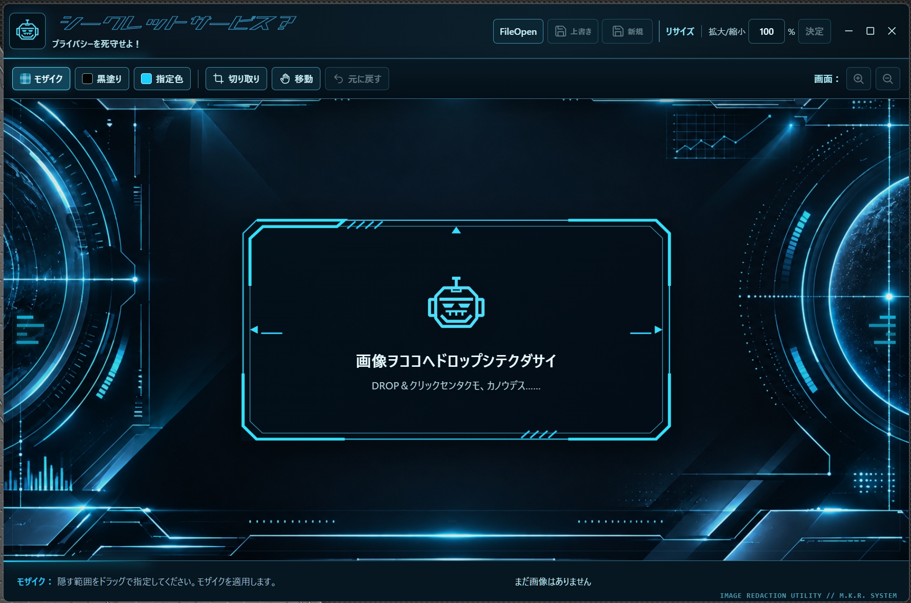

# シークレットサービス？

**画像加工ソフトで、上から黒く塗れば大丈夫？**

**……いつから、本当に消えていると「錯覚」していた？**

**ワレワレニオマカセクダサイ🤖**

見た目が黒くなっただけでは、元の情報が残っていることがあります。

「シークレットサービス？」は、隠したい範囲の**画像そのものを書き換えて保存**。
本名、住所、アカウント情報、偽名、内緒話、うっかり映り込んだ秘密まで。

**見せたい画像だけ見せる。見せたくないものは、きっちり隠す。**

**プライバシーを死守せよ！**

取捨選択は君の手にある。

スクリーンショットを見せたい。でも、名前や住所、アカウント情報などは隠しておきたい。
そんなとき、画像の見せたくない部分を四角く囲んで隠せる Windows 用アプリです。

隠し方は **モザイク・黒塗り・指定色** の3種類。
指定色では好きな色を選べるほか、**スポイトで画像内の色を拾って、背景と同じ色で自然に隠す**こともできます。

必要な部分だけを切り取ったり、画像そのものの大きさを変えたりしてから保存することもできます。

## できること

| 操作 | できること |
| --- | --- |
| モザイク | 囲んだ部分を粗くして隠します。 |
| 黒塗り | 囲んだ部分を黒く塗りつぶします。 |
| 指定色 | 好きな色で囲んだ部分を塗りつぶします。スポイトで画像内の色を直接拾えるので、背景と同じ色で自然になじませることもできます。 |
| 切り取り | 四角く囲んだ範囲だけを残します。 |
| リサイズ | 保存する画像そのものの大きさを変えます。 |
| 元に戻す | 直前の加工や切り取り、リサイズを取り消します。 |

隠したい場所は、1枚の画像で続けて何か所でも指定できます。

## はじめての使い方

1. **画像を開く**
   画像ファイルを画面中央にドラッグして離すか、中央をクリックします。上の **FileOpen** から選ぶこともできます。

2. **隠し方を選ぶ**
   画面上部の「モザイク」「黒塗り」「指定色」のどれかを押します。

   「指定色」では好きな色を選べるほか、**スポイトを使って画像から直接色を取ることもできます。**
   背景と同じ色を拾えば、塗りつぶした部分を周囲になじませることができます。

3. **隠す場所を囲む**
   画像の上でマウスの左ボタンを押し、隠したい範囲を四角く囲むように動かして、ボタンを離します。
   別の場所も同じように続けて囲めます。

4. **仕上がりを確認する**
   間違えたら「元に戻す」を押します。
   必要なら「切り取り」で、残したい範囲だけを切り取ることもできます。

5. **保存する**
   はじめて使う場合は、上のフロッピーマークの **「新規」** がおすすめです。
   保存場所と名前を選ぶと、元画像を残したまま別の画像として保存できます。

隠す範囲を囲むと `AREA REDACTED`、保存が完了すると `REDACTION COMPLETE` と表示されます。

## 「新規」と「上書き」の違い

- **新規**
  別の画像として保存します。元画像は残ります。
  最初のファイル名には `-smoke` が付きます。
  例：`photo.png` → `photo-smoke.png`

- **上書き**
  開いた元画像を、加工後の画像に置き換えます。
  保存前に確認画面が表示されます。
  元画像を残しておきたい場合は「新規」を使ってください。

「元に戻す」は、編集中の操作を取り消すためのボタンです。

**一度上書き保存した元画像を復元する機能ではありません。**

## 画像の大きさと画面表示

上段の **「リサイズ」** は、保存する画像そのものの大きさを変更する機能です。

たとえば `80%` と入力して「決定」を押すと、画像そのものが元の大きさの80%になります。

右側の **「画面：＋／－」** は、編集しやすいように画面上の見え方だけを拡大・縮小する機能です。

こちらを操作しても、**保存する画像そのものの大きさは変わりません。**

拡大して画像が画面から見切れたときは「移動」を選び、画像をドラッグして表示位置を動かせます。

## 対応する画像

- **開ける画像**：PNG、JPEG、WebP、BMP
- **「新規」で保存できる画像**：PNG、JPEG
- **「上書き」**：開いた画像と同じ形式で保存

## 大切な情報を隠すときは

保存した画像をもう一度開いて、隠し忘れがないか確認することをおすすめします。

名前や住所、アカウント情報など、**文字を確実に読めない状態にしたい場合は「黒塗り」**が分かりやすいです。

「ここに何かあった」と目立たせたくない場合は、**「指定色」＋スポイト**をどうぞ。
周囲の背景色を拾って塗りつぶせば、黒い四角を置くより自然になじませることができます。

## キーボードでも操作できます

- `Ctrl+O`：画像を開く
- `Ctrl+Z`：元に戻す
- `Ctrl+S`：上書き保存（保存先のない画像では保存先を選択）
- `Ctrl+Shift+S`：別の画像として保存
- `Ctrl++` / `Ctrl+-`：画面表示の拡大／縮小
- `Ctrl+0`：画像全体を画面に合わせる

## ダウンロード

**Windows 64ビット用・インストール不要。**

[最新版をダウンロード](https://github.com/Geek0426/SecretService/releases/latest)

ダウンロードした実行ファイルから、そのまま起動して使えます。

**「何を見せて、何を隠すか。」**

それを決めるのは、あなたです。

**プライバシーを死守せよ！🤖**
